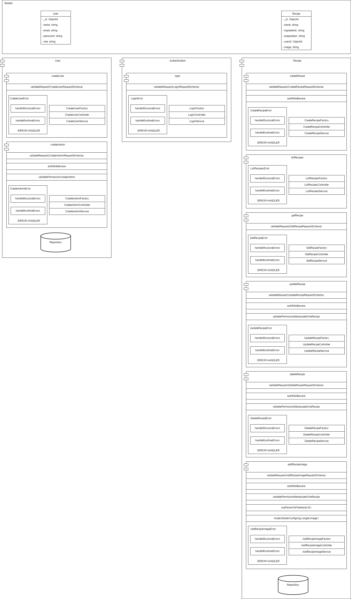
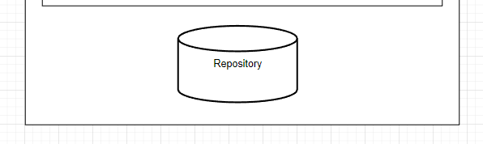
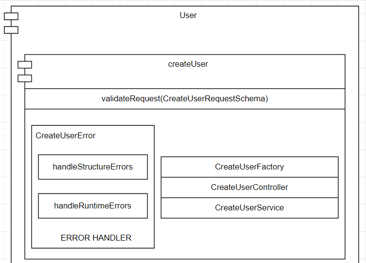
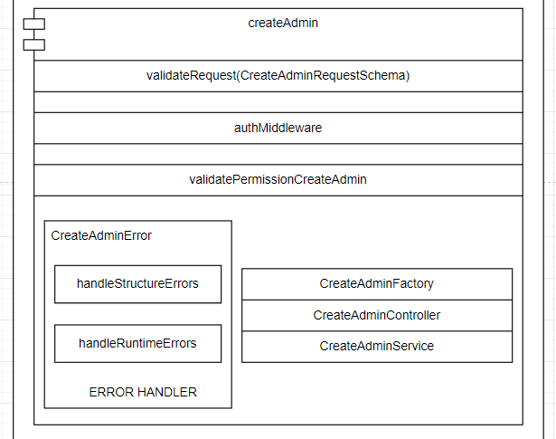
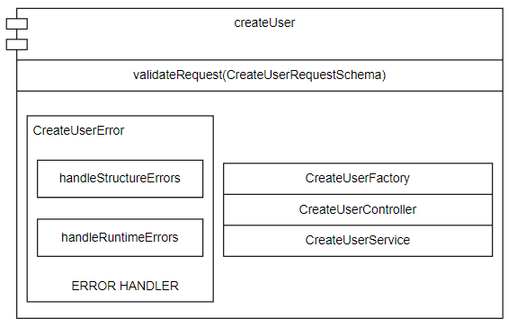
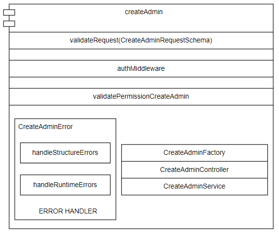
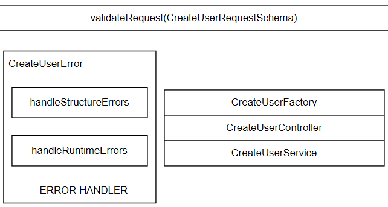
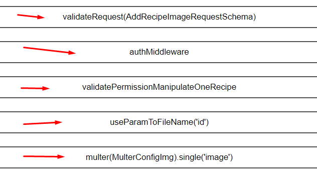
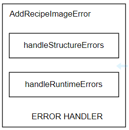
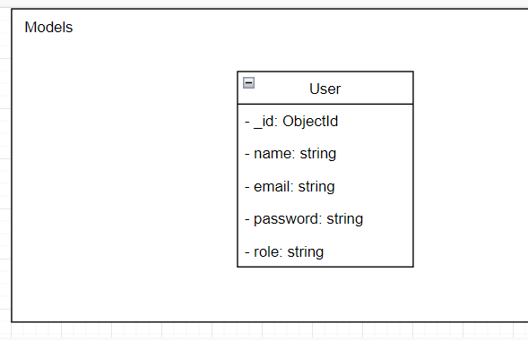

# Visão geral da Arquitetura da API 🚀:

## `Módulo:`
#### Construí a arquitetura baseada em `módulos`, onde cada `módulo` é basicamente um agrupamento de requisitos ou histórias de usuário que dizem respeito à uma entidade.

#### `Repository Pattern`
> Alguns módulos possuem uma camada que encapsula a lógica de acesso aos recursos do banco, esta camada possui métodos genéricos para acesso ao banco (findOne, insertOne...).

### Exemplo do módulo `User`:

## `SubMódulo:`
#### Um `SubMódulo` satisfaz um requisito ou história de usuário.

> obs: Como cada **SubMódulo** representa um requisito ou história de usuário eu os usei para direcionar a construção dos **testes de integração**

### Exemplos dos `SubMódulos` do `Módulo User`:

## `Camadas dentro dos SubMódulos:`

#### Cada `SubMódulo` contém 2 camadas a camada de `Serviço (Service Layer)` e a camada de `Controle (Controller Layer)`, além de aplicação do `Factory Method Pattern`, onde temos um método que fabrica uma instância de controle com suas devidas dependências injetadas. Além disso, temos uma repartição especializada em  tratar de erros e a depender do recurso solicitado temos alguns intermediários até chegar no core do `SubMódulo`

### Exemplo do conteúdo de um SubMódulo do módulo `User`:

## `Intermediários (Middlewares):`

#### Alguns módulos possuem diversos `middlewares`, um `middleware` tem o papel de empregar uma sequência de instruções com a finalidade de validar algo ou interceptar o fluxo ou aplicar um processamento especial para algum campo.

### Exemplos de `middlewares`:

## `Error Handler:`

#### O "ERROR HANDLER" que está presente nos `SubMódulos` se divide em 2 métodos um que captura e trata dos `erros estruturais` que são disparados pelo middleware que valida a request (validateRequest) e outro que lida com os `erros em tempo de execução` exceções lançadas pela camada de serviço do `SubMódulo`.

## `Camada de Modelos (Models Layer):`

#### Coloquei a `camada de modelos` em um barramento a parte com o propósito de facilitar o compartilhamento deste módulo entre outros serviços que utilizam estas mesmas entidades, usei o `JOI` para validar os conteúdos trafegados por meio de `Schemas` e usei o `DTO Pattern (Data Transfer Object Pattern)`

